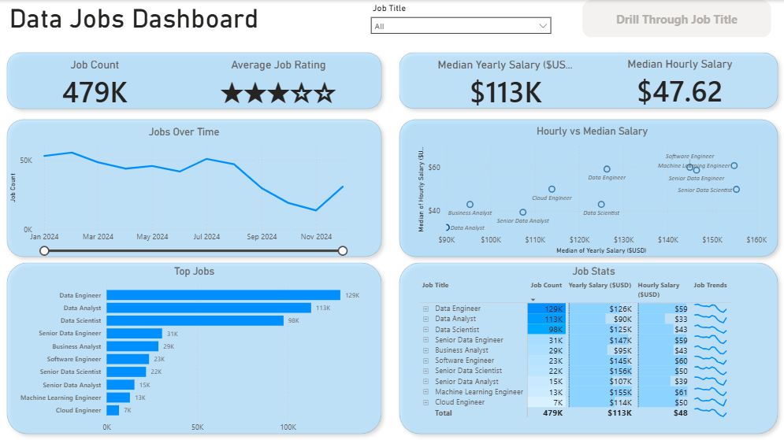
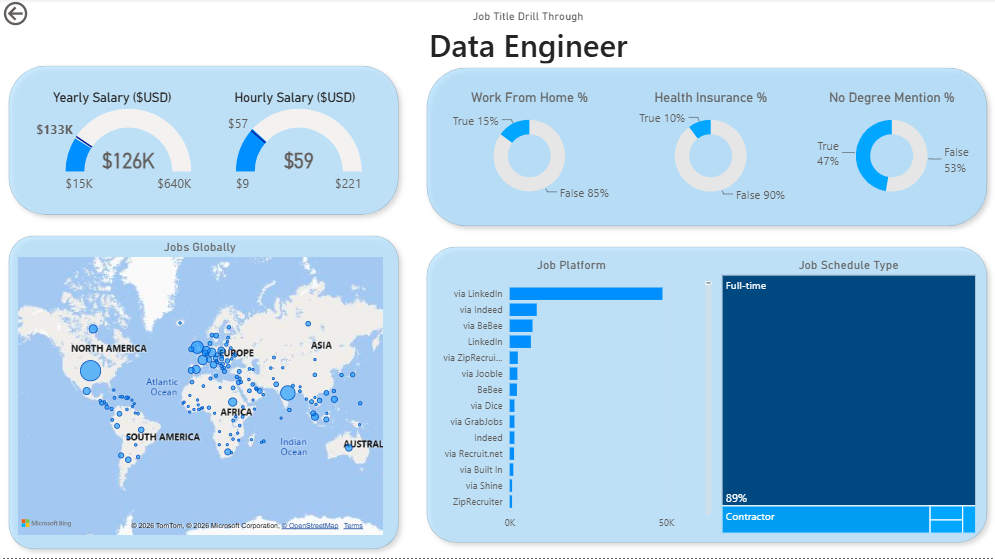

# Data Jobs Dashboard

## 📌 Overview
Interactive Power BI dashboard that analyzes global data job postings, highlighting hiring trends, salary distributions, and job market insights. The report also includes a drill-through page with detailed information for individual job roles.

---

## 📸 Screenshots

### General Overview

### Data Engineer Drill Through

---

## 🛠️ Skills Demonstrated

- **Power Query:** Cleaned and transformed the dataset before analysis.
- **DAX:** Created measures for job count, median yearly salary, median hourly salary, and percentage metrics.
- **Interactive Reporting:** Implemented slicers and drill-through navigation for detailed analysis by job title.
- **Data Visualization:** Built KPI cards, line charts, bar charts, scatter plots, maps, gauges, donut charts, tables, and treemaps.
- **Dashboard Design:** Organized the report into an executive overview and a detailed drill-through page for individual job roles.

---

## 📊 Dashboard Features

### Overview Page
- Displays total job postings.
- Shows average job rating.
- Presents median yearly and hourly salaries.
- Tracks job posting trends over time.
- Compares hourly salary against yearly salary by job title.
- Highlights the most common data-related job titles.
- Provides a detailed summary table with salary and hiring metrics.

### Drill-Through Page
- Detailed analysis for a selected job title.
- Yearly and hourly salary gauges.
- Work-from-home percentage.
- Health insurance availability.
- Degree requirement percentage.
- Global distribution of job postings.
- Most common hiring platforms.
- Employment schedule breakdown (Full-time, Contractor, etc.).

---

## 📁 Repository Structure

- `data/` – Source dataset used in the report.
- `images/` – Dashboard screenshots.
- `Data_Jobs_DashboardN1.pbix` – Main Power BI report.
