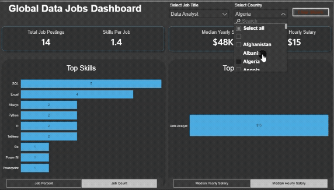
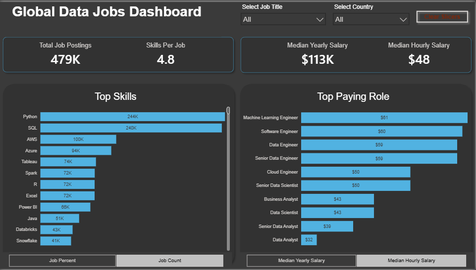
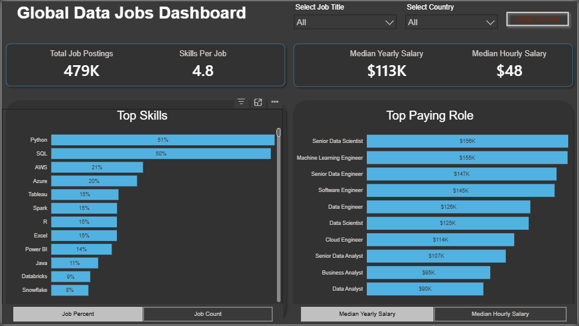

# Global Data Jobs Dashboard

## 🎬 Project Media

### Interactive Demo

### Screenshots

  
  

## 📌 Overview
Interactive Power BI dashboard that analyzes global data job postings, highlighting top skills, salaries, and high-paying roles across the data industry. The report delivers comprehensive market insights to help professionals align their skills with current market demands.

## 💡 Business Questions Answered

- Which skills are most frequently requested by employers?
- Which data roles have the highest median salaries?
- What is the global median salary for data professionals?
- How many job postings are available?
- Which skills appear most often across different job titles?
- How do job demand and salaries change by country?

## 🛠️ Skills Demonstrated
* **Power Query:** Advanced data cleaning, column transformation, and data type management.
* **DAX:** Developed customized measures for overall job counts, median yearly salaries, and median hourly metrics.
* **Data Modeling:** Established a robust star schema layout connecting dimension tables (`date_dim`, `skills_dim`, `company_dim`) to the core fact table.
* **Data Visualization:** Built interactive bar charts, analytical cards, custom navigation tabs, and dynamic slicers for title and country filtering.

## 📊 Dashboard Features
### Insights Page
* **Total Job Postings:** High-level metric showing 479K available positions.
* **Salary Benchmarks:** Displays a median yearly salary of $113K and a median hourly rate of $48.
* **Top Skills Tracker:** Interactive chart detailing Python and SQL as leading market demands.
* **Top Paying Roles:** Comparative horizontal bar chart highlighting salary levels for Senior Data Scientists, Machine Learning Engineers, and other data roles.

## 📂 Repository Structure
* **images/** — Dashboard screenshots and animated demonstration.
* **global_datajobs_dashboard.pbix** — Main Power BI report file.
* **README.md** – Project documentation.

